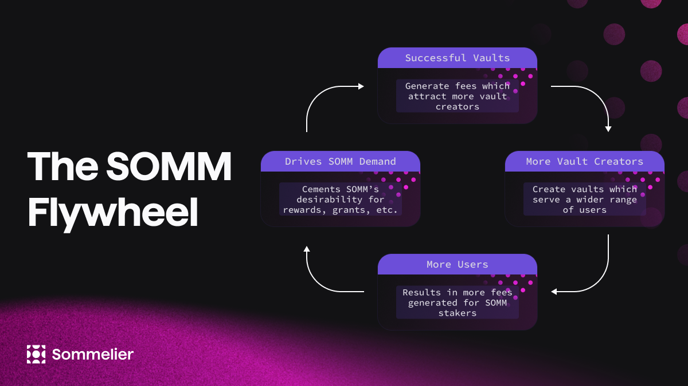

# Tokenomics

## SOMM Token Basics

**Ticker:** SOMM\
**Supply:** 500 Million (Fixed)

SOMM is the native token of the Sommelier network, a proof-of-stake blockchain built on the Cosmos SDK. SOMM is a crucial component of the network and plays a vital role in ensuring its security and operation. SOMM has three critical functions within the Sommelier ecosystem.

**Staking for Proof-of-Stake Consensus:** SOMM can be staked to select validators to secure the network. Validator selection is critical to SOMM, as it distinguishes Sommelier strategies from conventional asset management. By staking SOMM, users can help secure the network and earn rewards for doing so.&#x20;

**Gas Fees:** SOMM can be used to pay for gas fees (transaction fees) on the network. Transaction fees paid in SOMM help to ensure the network runs smoothly.\
\
**Protocol Governance:** SOMM can be used to create and vote on proposals. By participating in governance, SOMM holders control key pieces of the protocol. They have the ability to approve new vaults and control the deployment of a large community Treasury.&#x20;

Overall, SOMM is an essential component of the Sommelier network, providing the necessary infrastructure for a decentralized and community-driven ecosystem.

## SOMM Token Unique Attributes

### Fixed Supply

While many of these functions are fairly typical for native tokens of proof-of-stake Layer 1’s, SOMM distinguishes itself thanks to its fixed token supply and non-inflationary staking rewards.

The SOMM token supply has been set at 500 million tokens to ensure that each participant’s ownership stake in the network remains constant over time. Providing this level of certainty makes it easier for prospective network participants, such as contributors, strategists, partners, and community members, to confidently commit to the Sommelier ecosystem, thereby amplifying its network effects.

### Staking Rewards

Sommelier vaults generate fees of which a portion is directed to SOMM stakers for securing the network. Therefore, the rate of staking rewards is directly correlated to vault success. As vault fees are collected they are auctioned off for SOMM which is then distributed to SOMM stakers as rewards.&#x20;

<figure><figcaption></figcaption></figure>

As successful vaults generate more fees, more strategists are attracted to build on the platform, creating additional vaults that, in turn, attract more users. The increase in users generates even more fees for SOMM stakers, further increasing the demand for SOMM, and making it more valuable for all participants in the Sommelier ecosystem. These network effects are compounded by the fact that the DAO effectively captures the value created by the protocol and its members.

### Investor Distribution

All investor distributions were complete as of August 2023.

### Addresses

#### Foundation Address

[somm1ymy6sx49d538gtdw2y6jnqwhcv3v9de8c92rql](https://www.mintscan.io/sommelier/address/somm1ymy6sx49d538gtdw2y6jnqwhcv3v9de8c92rql)

#### Vesting addresses

[somm1x47p0tjylnsmxyy33q4mhqtxhzwk50099t7cp2](https://www.mintscan.io/sommelier/address/somm1x47p0tjylnsmxyy33q4mhqtxhzwk50099t7cp2)

[somm1fcl08ymkl70dhyg3vmx4hjsqvxym7dawnp0zfp](https://www.mintscan.io/sommelier/address/somm1fcl08ymkl70dhyg3vmx4hjsqvxym7dawnp0zfp)

[somm1l2scvs2wve6lfz2ujgvrlkrsnw6g68dx6y0ykw](https://www.mintscan.io/sommelier/address/somm1l2scvs2wve6lfz2ujgvrlkrsnw6g68dx6y0ykw)

[somm1kv98xapa28s05x5exhupg3gzlfmkwfl32ye45r](https://www.mintscan.io/sommelier/address/somm1kv98xapa28s05x5exhupg3gzlfmkwfl32ye45r)

[somm18vdsal7vl5hdpgyejlvea5kn6pkndjvpy7cnew](https://www.mintscan.io/sommelier/address/somm18vdsal7vl5hdpgyejlvea5kn6pkndjvpy7cnew)

[somm17nupt6vqq2ndlaphc88gnsh60h6m5z7d39pnsu](https://www.mintscan.io/sommelier/address/somm17nupt6vqq2ndlaphc88gnsh60h6m5z7d39pnsu)

[somm1849m9wncrqp6v4tkss6a3j8uzvuv0cp7zy8q3h](https://www.mintscan.io/sommelier/address/somm1849m9wncrqp6v4tkss6a3j8uzvuv0cp7zy8q3h)

[somm1tf68ptqwlac8s4e9cp5ps5dcd9vahxww4g9e6t](https://www.mintscan.io/sommelier/address/somm1tf68ptqwlac8s4e9cp5ps5dcd9vahxww4g9e6t)

[somm1xgm66f0c0c9nu2z3c673tg8nhfv6d2j6y7ww2u](https://www.mintscan.io/sommelier/address/somm1xgm66f0c0c9nu2z3c673tg8nhfv6d2j6y7ww2u)

[somm1p0xd9dwqztlua5vjl686alvzn3fng5hacu5r04](https://www.mintscan.io/sommelier/address/somm1p0xd9dwqztlua5vjl686alvzn3fng5hacu5r04)

[somm1fxzkeu4xx7ldp0sjuhw37xlq37c58t96qn8dr2](https://www.mintscan.io/sommelier/address/somm1fxzkeu4xx7ldp0sjuhw37xlq37c58t96qn8dr2)

[somm14svlv4aw5r0g35cs7kh8pef6nleeu9yfk2tvrh](https://www.mintscan.io/sommelier/address/somm14svlv4aw5r0g35cs7kh8pef6nleeu9yfk2tvrh)

[somm1zfdtfsnxjzyy9ge6jrcczatxczmdddkvguahvw](https://www.mintscan.io/sommelier/address/somm1zfdtfsnxjzyy9ge6jrcczatxczmdddkvguahvw)

[somm17kevdey6athxarxu0m9rev6quv0cgu4r6dftmg](https://www.mintscan.io/sommelier/address/somm17kevdey6athxarxu0m9rev6quv0cgu4r6dftmg)

[somm1x5rmunevfr0cn3dypw86vp9r9c60zzlk8twpnr](https://www.mintscan.io/sommelier/address/somm1x5rmunevfr0cn3dypw86vp9r9c60zzlk8twpnr)

[somm1as22d4fv5s25jn3ud0ctu2keksgruhmdpj60vj](https://www.mintscan.io/sommelier/address/somm1as22d4fv5s25jn3ud0ctu2keksgruhmdpj60vj)

[somm12n4pgw42qy5lkw4at43eqmjcwr52meq9fcm52t](https://www.mintscan.io/sommelier/address/somm12n4pgw42qy5lkw4at43eqmjcwr52meq9fcm52t)

[somm1p0xd9dwqztlua5vjl686alvzn3fng5hacu5r04](https://www.mintscan.io/sommelier/address/somm1p0xd9dwqztlua5vjl686alvzn3fng5hacu5r04)

[somm15urq2dtp9qce4fyc85m6upwm9xul3049s838j8](https://www.mintscan.io/sommelier/address/somm15urq2dtp9qce4fyc85m6upwm9xul3049s838j8)

