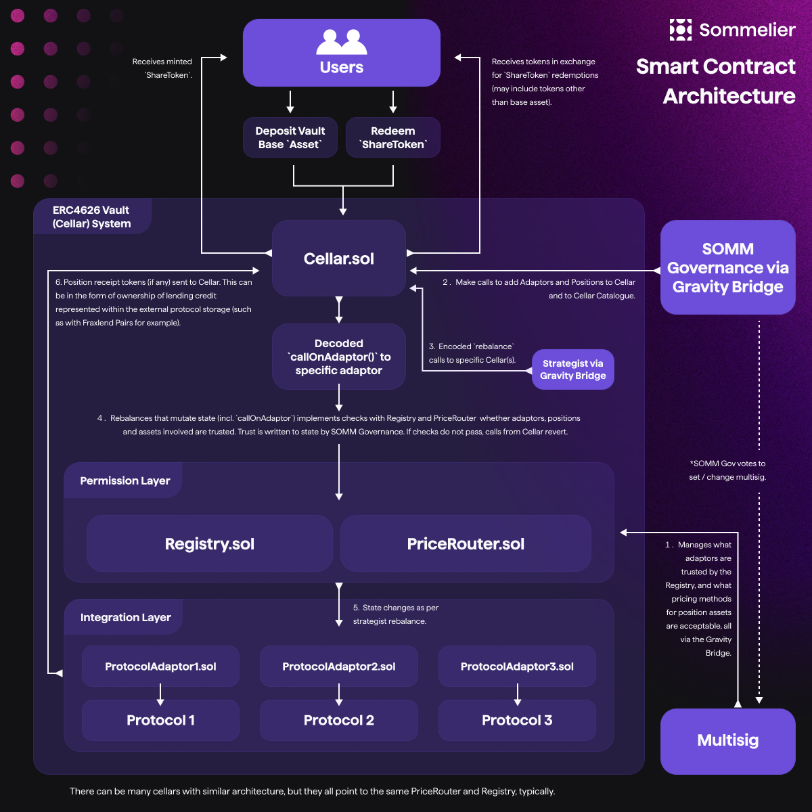

# Cellars (aka ERC 4626 Vaults)

<figure><figcaption>
High-Level Smart Contract Architecture where One Cellar has Multiple Adaptor Positions with Multiple Protocols
</figcaption></figure>

Cellars are the core user-facing smart contract of the Sommelier Cellars protocol. Cellars represent smart vaults that users can deposit into, earning yield and rewards with deposited funds, and withdraw from, based on the actions of the strategist (see ["Roles & Permissions"](../../roles-and-permissions.md) for more info). To make this user-facing functionality possible, Cellars hew close to the [ERC4626 standard](https://ethereum.org/en/developers/docs/standards/tokens/erc-4626/).&#x20;

> **Note:** Sommelier Cellars depart from the ERC4626 standard in [their implementation](https://github.com/PeggyJV/cellar-contracts/blob/main/src/base/Cellar.sol#L922) of `totalAssets`. According to the standard, `totalAssets` must _not_ revert. For Sommelier Cellars, `totalAssets` may revert. Integrators should take care to note and handle this difference.

A Sommelier Cellar implements an API for users, strategists, and governance (see ["Roles & Permissions"](../../roles-and-permissions.md)). Users can deposit tokens to the Cellar, mint Cellar shares, and earn yield. Strategists can use `callOnAdaptor` to change the allocation of funds in the cellar (these operations can be termed "rebalances"). Governance has a number of safety mechanisms available (see ["Roles & Permissions"](../../roles-and-permissions.md) for a detailed list).

When a user deposits tokens to a Cellar, tokens are locked for a number of seconds specified by the `shareLockPeriod` state variable. The default `shareLockPeriod` is 2 days. Once a user has deposited, their tokens cannot be withdrawn until the share-lock period has passed: this prevents opportunistic sandwiching flows around rebalances, and protects earned yield for the benefit of honest depositors.

#### totalAssets and Rebalance Deviations

Sommelier Cellars are meant for steady growth, yield accumulation, and asset appreciation: therefore, one restriction of a Cellar is that strategist rebalances should not significantly change the TVL. This not only prevents the emergence of sandwiching opportunities, but it also protects honest depositors against malicious strategists that may try to drain cellar assets through adapter calls.&#x20;

This restriction is enforced via the `totalAssets` [check](https://github.com/PeggyJV/cellar-contracts/blob/c8d427c013013ba4fd7e8ea7fd25dbdea3d65efd/src/base/Cellar.sol#LL1351C1-L1352C1) at the end of `callOnAdaptor`.  The `totalAssets` function is designed such that it can always price the TVL of a Cellar in terms of the Cellar's base asset (the `holdingPosition`). Before a series of rebalances (or "adaptor calls"), the starting amount of `totalAssets` is stored. After the calls are complete, `totalAssets` is recalculated and compared against the pre-rebalance value. If the new TVL differs from the old TVL by a ratio greater than the `allowedRebalanceDeviation`, the transaction will revert. In addition, adapter calls cannot mint or burn cellar shares: the `totalShares` [check](https://github.com/PeggyJV/cellar-contracts/blob/c8d427c013013ba4fd7e8ea7fd25dbdea3d65efd/src/base/Cellar.sol#LL1353C12-L1353C12) ensures that strategists cannot find attack vectors that keep the TVL constant but redirect shares toward bad actors.

<figure><figcaption>
CellarsV2.5 SharePriceOracle Architecture 
</figcaption></figure>

> **Note:** as mentioned in ["PriceRouter Details,"](https://app.gitbook.com/o/4atpZ4Rl0cQ7Zflpk08d/s/gTlidpvGOM2ZKa8GDX86/\~/changes/9/smart-contracts/advanced-smart-contracts/pricerouter-details) the CellarsV2.5 architecture that newer Cellars are beginning to use (such as [TurboswETH](https://app.sommelier.finance/strategies/Turbo-SWETH/manage)) incorporate Chainlink Automation to carry out the gas-intensive calculations for `totalAssets`. The CellarsV2.5 architecture that uses the `ERC4626SharePriceOracle` is the `CellarWithOracle.sol` implementation, specifically. It relies on the `latestPrice` or `timeWeightedAverageAnswer` for the `sharePrice` that is then used to calculate `totalAssets`.

The `totalAssets` and `totalShares` checks are the principal security mechanisms that prevent abuse of adaptor calls - Cellars cannot and do not introspect the contents of these calls. As long as an adaptor and position have been trusted by governance and set up on the Cellar, the Cellar allows any calldata payload to be sent to that adaptor. For Cellars with specific use cases or high-reputation strategists, governance can increase the TVL envelope by calling `setRebalanceDeviation`.

The rebalance deviation is enforced in both directions, for unexpected increases as well as decreases in `totalAssets`. For rebalance operations for which the strategist expects to generate a substantial profit, outside the allowed deviation, a [Vesting Contract](https://github.com/PeggyJV/cellar-contracts/blob/main/src/modules/vesting/VestingSimple.sol) should be used (with a [Vesting Adaptor](https://github.com/PeggyJV/cellar-contracts/blob/main/src/modules/adaptors/VestingSimpleAdaptor.sol)). Earned profit can be redirected to vesting contracts during rebalance operations, allowing them to slowly re-accumulate into the Cellar's TVL.

#### Position Ordering and Max Positions

Within a cellar, each position is stored in ordered lists, separated into `creditPositions` and `debtPositions`.&#x20;

* `creditPositions` represent balances that contribute to TVL (for instance, holding an ERC20 token outright).
* `debtPositions` represent debt incurred by the Cellar, which decreases the TVL (for instance, an open borrow from AAVE).
* The `holdingPosition` represents a specially-designated position, where user deposits are immediately routed.&#x20;

The values of these lists are `uint32` values that represent the `positionId` as specified in the Registry (see ["Registry" ](https://app.gitbook.com/o/4atpZ4Rl0cQ7Zflpk08d/s/gTlidpvGOM2ZKa8GDX86/\~/changes/9/smart-contracts/advanced-smart-contracts/registry-details)for more details). Cellars are deployed with a preset number of `creditPositions`, `debtPositions`, and a `holdingPosition`. The holding position must also be a member of the `creditPositions` array.

Strategists manipulate position ordering in the following ways:

* Strategists may add a new position with `addPosition` (see "Registry" for a discussion of restrictions and dependencies around this call).
* Strategists may remove a position with `removePosition`. When removing a position, the TVL of that particular position must be 0 or the transaction will revert. In addition, the holding position cannot be removed.&#x20;
* Strategists may swap position ordering with `swapPositions`. Positions cannot be moved from the credit to debt arrays or vice versa - they can only be swapped within their own array.\

For credit positions, position ordering impacts withdrawal priority - when users withdraw, funds will always be sourced from each `creditPosition` [in order](https://github.com/PeggyJV/cellar-contracts/blob/c8d427c013013ba4fd7e8ea7fd25dbdea3d65efd/src/base/Cellar.sol#LL878C36-L878C36). If the first `creditPosition` does not have enough liquid funds to meet the withdrawal, each successive position will be withdrawn from in order until the required amount is met. Therefore, it is recommended that strategists keep a liquid position - such as the `holdingPosition` - in the first slot in the `creditPositions` array, to minimize effects on Cellar allocations and reduce gas costs. For debt positions, position order has no effect.

In addition, each Cellar is restricted to have a number of credit positions and debt positions less than or equal to the Cellar's `MAX_POSITIONS` value. The strict upper bound on the number of positions prevents unbounded gas costs during the `totalAssets` logic.

See the next page for a current API for `Cellar.sol`.
