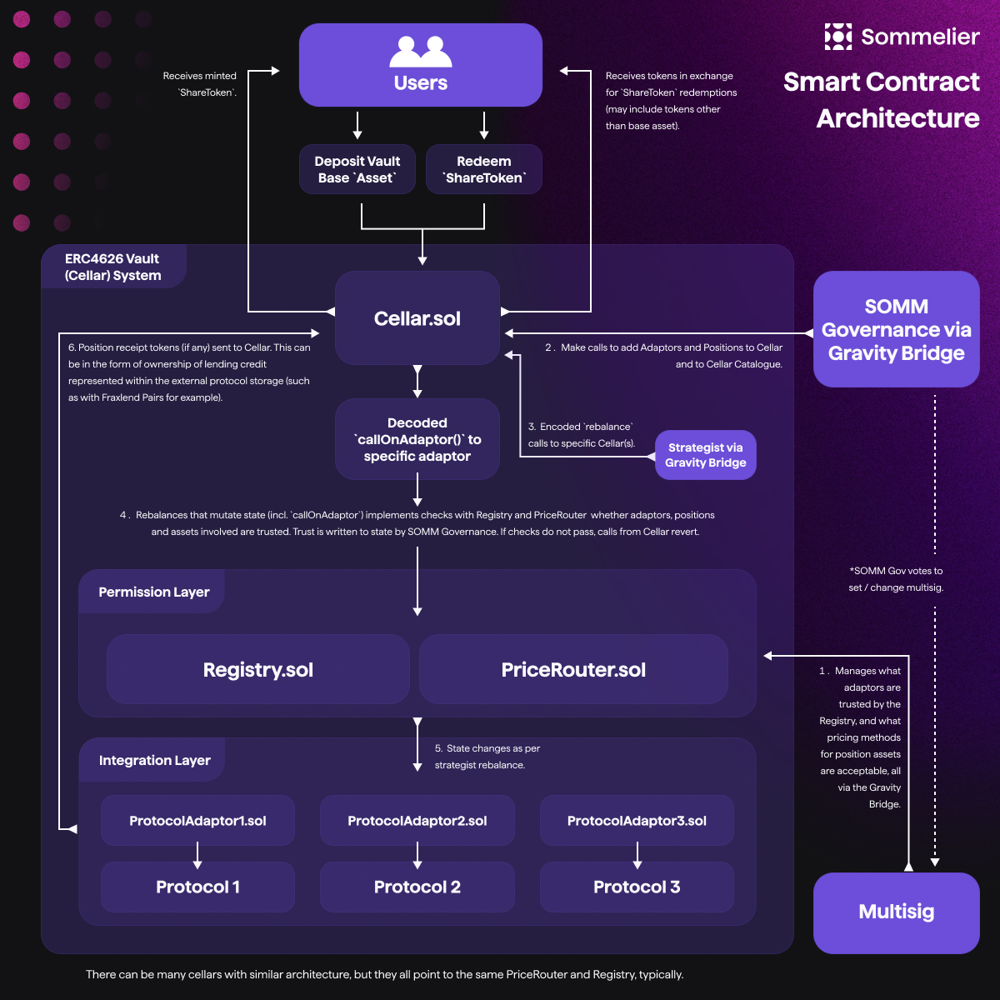

# Roles & Permissions

Every Sommelier Cellar is a distributed effort, and multiple parties are needed to develop, deploy, and grow a successful cellar. This has been shown in the schematics so far (shown again below for easier reference).

<figure><figcaption>
High-Level Smart Contract Architecture with Cellars, Permission and Integration Layers
</figcaption></figure>

### Users

Users can use Cellars to earn yield on their deposits - the functionality available to all users follows the [ERC4626 interface](https://ethereum.org/en/developers/docs/standards/tokens/erc-4626/). Users of Cellars may:

* Deposit funds into a Cellar to earn yield, via the `deposit` and `mint` functions
* Withdraw deposits from Cellars, via the `withdraw` and `redeem` functions
* Transfer cellar shares to another address, via `transfer` and `transferFrom` functions

See the [ERC4626 standard](https://ethereum.org/en/developers/docs/standards/tokens/erc-4626/) for the differences between `deposit/withdraw` and `mint/redeem`.

### Strategists

Strategists are the managers of a Cellar, who develop and execute the strategies that earn users yield. Strategists functionality is limited to the supported adaptors for each Cellar (see "Adaptors").

Each strategist can perform actions through their adaptors via the `callOnAdaptor` function. Strategists must craft their target adaptor calls, with associated `calldata`, and submit them via the Sommelier chain. The Gravity Bridge then forwards the strategist's provided payload to the `callOnAdaptor` function.&#x20;

For a more comprehensive description of all the ways strategists can use adaptors to create and execute on-chain strategies, see the ["Adaptors"](./advanced-smart-contracts/adaptors/README.md) section.

In addition to adaptor calls, strategists can manage the ordering of their cellar's positions. This ordering informs withdrawal priority for a given Cellar - the first positions will be withdrawn from first. Positions can be managed using the following calls:

* `setHoldingPosition`
* `addPosition`
* `removePosition`
* `swapPositions`

### Governance

<figure><figcaption></figcaption></figure>

Sommelier's governance body, governed by stakers of native $SOMM on the Sommelier Chain, is responsible for the security and configuration of both individual Cellars, as well as the entire Cellar infrastructure. The SOMM Governance carries out some direct management of the Sommelier protocol architecture, and votes in a multi-sig to carry out other responsibilities, as seen in the above image.&#x20;

#### SOMM Governance

Within the context of a single cellar, governance has the following abilities:

* Initiate and lift shutdowns of the Cellar in emergency scenarios, via `initiateShutdown` and `liftShutdown`.
* Set the amount of time cellar deposits are initially locked, via `setShareLockingPeriods` (see "Share Locking Periods" for more information, also this only affects Cellars that do not have share price oracles).
* Set the allowed rebalance deviation for a cellar during a batch of adaptor calls, via `setRebalanceDeviation` (see ["Adaptors"](./advanced-smart-contracts/adaptors/README.md) for more information).
* Set up new adaptors, and positions for a given cellar to enable new functionality, via `addAdaptorToCatalogue, and addPositionToCatalogue.`

### SOMM Governance Voted In Multi-Sig

The Multi-Sig is voted in via SOMM Governance and can be voted out at any time. Together, the Multi-Sig and the SOMM Governance carry overlapping responsibilities to manage the `Registry`, `PriceRouter` and the `Cellars`. The Multi-Sig handles aspects associated with the `Registry` and `PriceRouter`, of which include:

* Adding new assets to the Price Router via `addAsset` (see ["Price Router"](./advanced-smart-contracts/pricerouter-details/README.md) for more information).
* Change automation settings on the Price Router, via `setAutomationRegistry`, `setGasFeed`, `setGasConstant`, and `setMinDelta`.
* Adding new slots to the Registry via `register`, or updating existing stored addresses (see ["Registry"](./advanced-smart-contracts/registry-details/README.md) for more information).
* Setting the address of the fee distribution mechanism on the Sommelier Chain, via `setFeesDistributor`.
* Enabling cellars to use a newly deployed adaptor given certain risk parameters, via `trustAdaptor`.
* Enabling cellars to use positions that interact with trusted adaptors given certain risk parameters, via `trustPosition`.

### Use of \`onlyOwner\`

Those reading the contracts will notice that within Solidity code, both Strategist and Governance functions are protected with `onlyOwner` and no further modification. All Cellar and Cellar infrastructure deployments are owned by the [Gravity Bridge](https://etherscan.io/address/0x69592e6f9d21989a043646fe8225da2600e5a0f7). Therefore, both strategists and governance cannot interact with the contract directly via the EVM - they must submit their updates to the Sommelier chain itself, which will forward them to the Gravity Bridge for execution on Ethereum mainnet. This forwarding process is where the delineation between "strategist permissions" and "governance permissions" takes place.
